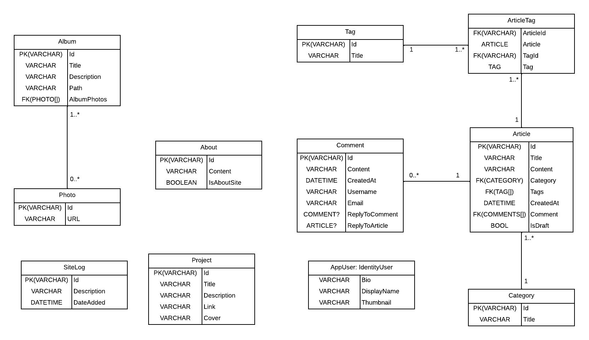
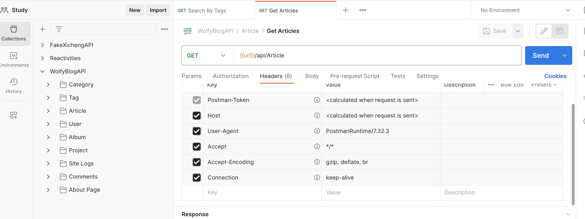

# WolfyBlog API - .NET Web Application

This project is a .NET 6.0 Web Application showcasing a range of features and packages relevant to modern web development practices

## Project Specifications
- SDK: `Microsoft .NET.Sdk.Web`
- Target Framework: `.NET 6.0`
- Docker Compose Path: `../docker-compose.dcproj`

# Key Dependencies
- `Swashbuckle.AspNetCore: 6.2.3` - For API documentation using Swagger.
- `Microsoft.EntityFrameworkCore & Related: 7.0.0` - For database operations and Entity Framework functionality.
- `Microsoft.AspNetCore.Identity.EntityFrameworkCore: 6.0.11` - Provides Identity system including user, role, and membership management.
- `AutoMapper.Extensions.Microsoft.DependencyInjection: 12.0.1` - For object-object mapping.
- `Microsoft.AspNetCore.Authentication.JwtBearer: 6.0.11` - For JWT authentication.
- `CloudinaryDotNet: 1.20.0` - For media operations with Cloudinary.
- `AspNetCoreRateLimit: 5.0.0` - For API request rate limiting.
- `Slugify.Core: 4.0.1`- For generating URL-friendly slugs from strings.

# Project Structure
Here are the key folders and their purpose:

- **Entities:** Contains entity classes representing database tables.
- **Database:** Houses database-related scripts, configurations, and migrations.
- **Services:** Contains service classes and related functionalities.
- **DTOs:** Data Transfer Objects used for data communication.
- **Profiles:** Houses mapping profiles, likely for AutoMapper.
- **ResourceParameters:** For parameters related to resources, often used for filtering and pagination.
- **Helper:** Utility classes and functions to assist core functionalities.

# Class DIagram

# Postman Collection

## Current Roadmap
- Create endpoints for ADMIN site only
- Add `category` property for Project entity
- Article comment pagination
- Add `Moment`
- Switch from Cloudinary to S3 Bucket
